# RangeMatch Product Feasibility Audit

> Date: 2026-08-12  
> Status: Product definition closed. Next work is Slice A (contracts, tests, code).  
> Product direction reviewed: buyer-side, parcel-level evidence investigation and due-diligence workspace  
> Implementation repository audited: `/Users/hongmanyi/RangeMatch`  
> Overall assessment: **Buildable now as a sharp Desktop Triage + Decision Brief; not yet ready as a reliable end-to-end Deal Room or a suitability decision product.**
>
> Locked decision: RangeMatch may enter Decision Brief productization. It may not enter suitability productization. A full Deal Room is not a prerequisite.

## Executive Summary

RangeMatch should ship a product that advances a transaction investigation, not one that claims to decide whether land is suitable for cattle or sheep.

The CPER engineering test geometry has been shown to produce a useful Desktop Triage. It has not been shown that an arbitrary real listing will reach the same completeness. Live adapters may succeed on supported U.S. parcels; that remains a conditional claim, not a coverage guarantee.

The system does not have enough evidence to issue a livestock suitability decision, carrying-capacity estimate, species ranking, legal-access conclusion, or verified-water conclusion. Those are not temporary copy problems; several require field, seller, title, water-right, or professional evidence that no general public API can supply.

The main blocker is therefore not “collect more factors.” It is the missing product orchestration layer between Unified Output and the buyer:

1. a Buyer Evidence Packet that projects decision-relevant observations and real candidate objects;
2. deterministic ranking of no more than three bottlenecks;
3. an LLM task focused on grounded interpretation, misreading warnings, action rationale, and counterfactuals;
4. a Validator that checks object identity, navigation precision, counterfactual language, and insight withdrawal;
5. a report UI organized by the buyer’s next decision rather than F01–F08 or `HOLD`.

The following succeeded in the **2026-08-12 audit environment**. They must not be restated as “the production data pipeline is stable.” RAP, Mireye, and government sources still need timeouts, retries, cache, partial-failure handling, and fallback.

- **423 backend tests pass** in the repository’s complete `.venv-livegate` environment;
- **22/22 frontend tests pass** and the production frontend build succeeds;
- Mireye DNS, TLS, and `/healthz` were live-reachable during this audit;
- the public RAP polygon API returned current cover and production responses during this audit;
- OpenAI credentials are configured, but a live minimal completion returned **HTTP 429**, so live narrative generation is not operationally reliable today;
- the current Buyer Report prompt and Validator still embody the old product: the prompt leads with continue/pause decisions and the Validator requires Engine decision labels to appear in the report.

The right executive decision is:

> **Proceed with the report-productization slice now. Do not restart F01–F08. Do not market the product as suitability. Fix the live LLM deployment before relying on it, and prove the experience on several real, user-confirmed listings before commercial launch.**

## 1. The Product We Are Actually Building

RangeMatch is:

> **An AI-assisted buyer-side diligence workflow that turns parcel evidence into a prioritized investigation plan and a traceable transaction brief.**

It answers:

> What is already established, what could still change the investigation, and what should the buyer verify next?

It does not answer:

> Is this land suitable, how many animals can it carry, should I buy it, or should I choose cattle over sheep?

### Product form

```mermaid
flowchart LR
    A["Address or coordinate"] --> B["Confirm one parcel"]
    B --> C["Run F01–F08"]
    C --> D["Unified Output"]
    D --> E["Buyer Evidence Packet"]
    E --> F["Code-ranked bottlenecks"]
    F --> G["LLM interpretation and action rationale"]
    G --> H["Deterministic Validator"]
    H --> I["Desktop Triage + Decision Brief"]
    I --> J["Documents, field evidence, professional review"]
    J --> K["Evidence changes and revised brief"]
```

The competition demo needs to prove the path through the first Decision Brief. A persistent Deal Room, document ingestion, and evidence-update loop are the commercial north star, not prerequisites for rewriting the report.

## 2. What Decision the Product Can Support

The product can support a **next-diligence decision**:

- confirm or correct the parcel first;
- request a document before visiting;
- plan a targeted field visit;
- engage a specific professional with a narrow question;
- pause additional spend because the input, adapter, or evidence target is not ready;
- continue investigating because a defined next action can materially reduce uncertainty.

It cannot support a **land-performance or transaction verdict**:

- suitable/unsuitable;
- buy/do not buy;
- carrying capacity or stocking rate;
- cattle-versus-sheep ranking;
- legal access;
- transferable water rights;
- year-round livestock-water sufficiency;
- profitability or appraisal.

This boundary does not make the product weak. It makes the value proposition precise: reduce wasted visits, duplicated lookups, vague professional assignments, and misordered diligence spending.

## 3. Current Data: What We Have, What It Establishes, and What It Cannot Establish

### 3.1 Current CPER evidence packet

The CPER artifact proves the pipeline can assemble a substantial parcel evidence portrait. It does not prove that every U.S. listing will return the same completeness.

| Factor | Current evidence | What it establishes | What it does not establish | Product readiness |
|---|---|---|---|---|
| F01 terrain | Parcel-derived elevation and slope from USGS 3DEP; CPER median elevation about 1,654 m and median slope about 2.40° | Terrain context for the confirmed engineering geometry | Grazing suitability, traversability for every animal, construction feasibility | Ready for brief |
| F02 herbaceous resource | RAP 2025 modeled parcel mean: PFG about 32.99%; annual herbaceous production about 937.68 lb/ac | Modeled annual vegetation/production context within documented RAP scope | Available forage, utilization, palatability, nutrition, carrying capacity; full parcel coverage | Usable with prominent coverage limitation |
| F03 livestock water | 9 mapped candidates; 3 sampled; 2 remotely supported; 0 field verified | A mapped hydrography inventory and review queue exists | Usable livestock water, reliability, capacity, quality, ownership, legal right, access | Category-level action ready; object-level report not yet wired |
| F04 soils/wetness/site | SDA parcel coverage reported complete in the CPER fixture | Parcel soil/ecological context exists | A universal operational conclusion or species choice | Ready as context |
| F05 climate | 1991–2020 mean annual precipitation about 345.74 mm/year | The canonical climate lookup is complete for this geometry | Climate adequacy, drought resilience, future performance | Ready as measured context |
| F06 geometry | About 1.404 million m², roughly 347 acres; perimeter about 4,750 m | Geometry-derived area and shape context | Survey accuracy, grazable acres, fencing cost | Ready with engineering-geometry disclaimer |
| F07 roads | TIGER road context; mapped road distance 0 m in current packet | Physical mapped-road contact/context | Legal access, usable entrance, passability, travel time, landlocked status | Ready with legal-access warning |
| F08 woody/shrub structure | RAP cover reused from F02 | Modeled woody/shrub context | Brush-management need, usable forage, full parcel coverage | Usable with coverage limitation |

### 3.2 Evidence-state composition

Five factors currently provide complete parcel/context evidence in the CPER Unified Output (F01, F04, F05, F06, F07). Three remain materially limited or verification-dependent (F02, F03, F08). This is enough for a triage brief, but not for a suitability verdict.

| Evidence state | Factor count | Factors |
|---|---:|---|
| Complete/context available | 5 | F01, F04, F05, F06, F07 |
| Coverage limited or needs verification | 3 | F02, F03, F08 |

### 3.3 The most important missing data

| Needed evidence | Can a current/public API supply it? | How it must enter the product | Demo blocker? | Commercial importance |
|---|---|---|---|---|
| Confirmed cadastral parcel for a real listing | Sometimes; current Mireye resolver can return candidates, but not every lookup yields geometry | User confirmation after address/coordinate resolution | No for CPER; yes for a real transaction brief | Critical |
| Water candidate identity and geometry in Buyer Report | Data already exists in the F03 remote-pilot artifact | Project source IDs, geometry kind, review status, and navigation precision into Buyer Evidence Packet | No for category-level actions; yes for object-level tasks | Critical |
| Field-observed livestock-water system | No universal public API | Structured field observation, geolocation, media, scope, date | No | Critical later |
| Seasonal reliability, capacity, water quality | Generally no single authoritative public API | Seller records, well data, inspection, laboratory or professional evidence | No | Critical later |
| Legal right to use water | State- and record-specific; cannot be safely generalized from NHD | Water-right documents and attorney/professional review | No | Critical later |
| Legal access/easement | No general road API establishes this | Title/easement documents and legal review | No | Critical later |
| Fence condition and usable entrances | No | Field visit and media | No | Important later |
| Listing and seller claims | Not yet productized | Listing URL/PDF/document extraction; retain as claims | No for report rewrite | Important later |
| RAP annual history | Yes; existing public provider supports annual history | Extend current single-year adapter and chart modeled variation | No | High-value immediate enhancement |
| Parcel spatial zones | Possible from current/richer raster workflows | Deterministic GIS computation, not LLM prose | No | Later visual enhancement |

## 4. Can We Call the Data We Need?

### 4.1 Current callability audit

| Source/path | Implementation status | Current audit evidence | Conclusion |
|---|---|---|---|
| USGS 3DEP | Adapter and fixtures implemented | Full backend suite passes in complete live-gate environment; prior controlled live gate preserved | Callable, subject to runtime dependencies and source availability |
| RAP cover/production | Polygon adapter implemented; current code uses 2025 | Live audit returned one cover and one production response with hashes | Callable now; output still has coverage limitations |
| USGS NHDPlus HR | Candidate adapter and remote-pilot artifacts implemented | Candidate counts and sampled objects exist in artifacts | Callable; object projection into report is missing |
| USDA SDA | Parcel adapter implemented | CPER fixture reports complete coverage; tests pass in full environment | Callable, subject to source availability |
| NOAA normals | Adapter implemented; canonical local NetCDF path exists | Tests pass in full environment | Operational through current packaged/cached source path; not evidence of an always-live remote service |
| Census TIGER | Adapter and controlled live gate implemented | Tests pass; prior live-gate artifacts preserved | Callable, subject to county download/source availability |
| Mireye lookup/context | Resolver, catalog gate, and normalized adapters implemented | During this audit: credentials present, DNS/TLS healthy, `/healthz` 200 | Transport callable now; a successful transport does not guarantee parcel geometry for every lookup |
| OpenAI narrative | Provider and deterministic fallback implemented | Credentials present; minimal live completion returned HTTP 429 | Not operationally reliable today; fix quota/rate limit and add resilient retry/fallback |

### 4.2 Runtime quality

- Backend: **423/423 tests pass** with `.venv-livegate`.
- Default `.venv`: missing `rasterio` and `netCDF4`, producing 2 errors. The project dependency declaration does not currently include those packages. This is a packaging/reproducibility defect.
- Frontend: **22/22 tests pass**.
- Frontend production build: passes; Vite warns that the principal minified JS chunk is about 1.28 MB.

### 4.3 What “callable” must mean in product language

The UI must not collapse these distinct states:

1. source endpoint reachable;
2. adapter returned a result;
3. parcel coverage quantified;
4. observation is in product scope;
5. object identity is sufficient for an action;
6. field/legal fact is verified.

RAP proves why this matters: the API returned successfully today, but parcel coverage remains unquantified. Mireye proves the same point: health and authentication can succeed while a specific lookup returns no parcel polygon.

## 5. Does the LLM Have the Required Ability?

### Short answer

**Yes for the intended interpretation task; no for the scientific, GIS, legal, or field-verification tasks.**

### 5.1 What the LLM can do well

Given a structured Evidence Packet and fixed IDs, a modern LLM can:

- combine compatible observations into a readable insight;
- explain why a number is useful without overclaiming what it proves;
- distinguish measured, modeled, mapped, claimed, and verified evidence;
- warn against the exact tempting misinterpretation for this parcel;
- explain code-ranked bottlenecks in buyer language;
- write rationale for deterministic actions;
- express conditional counterfactuals;
- adapt the same evidence for a buyer, broker, attorney, or field specialist;
- revise or withdraw language after an evidence-state change.

Example of valid LLM reasoning:

> Annual precipitation already has a canonical parcel value, so repeating that lookup is unlikely to reduce the current uncertainty. Mapped water and physical road contact remain operationally or legally unverified. The next investigation should therefore target water-system evidence and access documents, not remeasure precipitation.

This is a statement about information value and investigation order—not about climate adequacy.

### 5.2 What must remain deterministic

Code, adapters, or reviewed rules must own:

- all spatial calculations and coverage ratios;
- source IDs, candidate IDs, geometry types, and navigation precision;
- numeric values, units, time periods, and evidence states;
- bottleneck ordering and maximum count;
- permitted action templates by object/state;
- prohibited inference rules;
- Engine decisions and hard constraints;
- report validation and fallback.

### 5.3 What the LLM cannot safely do

The LLM must not:

- decide suitability or purchase merit;
- invent ecological/agricultural thresholds;
- estimate carrying capacity;
- rank cattle versus sheep;
- calculate parcel coverage from prose;
- invent a well, point, road, route, document, or candidate ID;
- promote modeled or mapped evidence to verified;
- infer water rights, legal access, seasonal reliability, capacity, or quality;
- interpret “not verified” as “does not exist.”

### 5.4 Current LLM implementation gap

The repository proves that constrained JSON generation, deterministic fallback, and numeric validation are feasible. However:

- the current prompt version is `RANGEMATCH_BUYER_REPORT@0.2.0` and still leads with continue/pause language and Engine `HOLD` semantics;
- the current Validator requires Engine decision labels to appear in report content, contrary to the new “technical appendix” direction;
- it validates grounded numbers and forbidden suitability/ranking language, but does not yet enforce candidate-object validity, navigation precision, deterministic bottleneck order, counterfactual conditionality, or insight withdrawal;
- the live OpenAI provider is currently rate/quota blocked with HTTP 429.

Therefore the answer is not “the LLM cannot reason.” The answer is:

> **The model has enough reasoning ability, but the current task contract, packet shape, Validator, and deployment reliability do not yet let that ability produce the new product safely.**

## 6. Can We Build an Exciting Report?

### Short answer

**Yes—if “exciting” means surprising, specific, visual, actionable, and trustworthy. No—if it means manufacturing a verdict from incomplete evidence.**

The current CPER data is enough to create a sharp Desktop Triage Brief. It is not yet enough for a magazine-grade parcel story with navigable object maps, multi-decade vegetation history, and evidence-change playback. Those are attainable enhancements, not prerequisites for the first compelling version.

### 6.1 The report’s narrative engine

Every section should answer a buyer question:

1. **What property did we actually investigate?**
2. **What is already established?**
3. **What do those observations jointly change about the investigation?**
4. **What would be easy to misread?**
5. **Which one to three unresolved facts matter now?**
6. **What exactly should happen next?**
7. **What changes if the action succeeds or fails?**

The report should not walk through eight equal factors. It should stage evidence around the transaction.

### 6.2 A compelling CPER first-page concept

> **The desktop scan is complete for this engineering test geometry. The next useful work is not another climate lookup; it is clarifying water evidence and legal access.**

Established facts:

- approximately 347 acres in the engineering geometry;
- terrain and 1991–2020 precipitation have canonical parcel-context measurements;
- RAP returned modeled 2025 vegetation and production context, but full parcel coverage is not quantified;
- mapped hydrography exists, but no livestock-water system is field verified;
- mapped roads contact the geometry, but legal entry is unresolved.

Three buyer-facing traps:

- mapped water is not a drinking system;
- RAP annual production is not available forage;
- mapped road contact is not legal access.

Bottleneck rank and action order are different lists. Water can be the larger evidence gap. Requesting title/access documents first can be only a cost-class choice (desktop, cheaper). Doing an action first does not make it the first bottleneck.

> Water-use verification and legal access are the two current core gaps. The water evidence gap may be larger; because access documents are cheaper to request from the desk, the product may start that request while preparing the subsequent water check.

Next actions, before object projection (execution order, not bottleneck rank):

1. request seller/title material that could establish the access basis;
2. review the mapped hydrography inventory and prepare an object-specific field plan only after candidate geometry is projected;
3. obtain evidence about any claimed developed water system, including location and operating history.

Counterfactual:

> If documents establish legal access, access drops from the leading bottlenecks; this still would not establish water availability or grazing performance.

That report is not monotonous because it creates tension, hierarchy, a next move, and a visible consequence—without pretending to know suitability.

### 6.3 Visuals that add real value

Ship these in sequence:

1. **Evidence portrait:** a compact measured/modeled/mapped/verified matrix.
2. **Bottleneck cards:** up to three, ordered by product policy, each with blocked inference and cost class.
3. **Action map:** only when candidate identity and geometry precision permit it; use line/area language for flowlines and bounding boxes, never false pins.
4. **RAP annual-history chart:** modeled annual variation from 1986 onward, with coverage and interpretation caveats.
5. **Evidence-change timeline:** before/new evidence/now supported/still unresolved/next bottleneck.
6. **Technical appendix:** factor details, Engine decisions, limitations, hashes, and full provenance.

RAP annual history is the best immediate data enhancement because it uses an existing public provider and creates an honest temporal story. It must not be converted into future prediction, usable forage, or carrying capacity.

## 7. The Exact User Journey to Build

| Stage | User question | Product output | Required data/logic | Success event |
|---|---|---|---|---|
| 0. Locate | Are we looking at the right land? | Candidate parcel and ambiguity | Mireye/address/coordinate resolution; user confirmation | Exactly one parcel confirmed |
| 1. Scan | What do we know already? | Evidence portrait | F01–F08 and spatial semantics | Scan completes with partial failures visible |
| 2. Interpret | What matters now? | Up to 3 bottlenecks | Deterministic bottleneck policy | User understands leading issue |
| 3. Choose | What should happen next? | Document, field, professional, or pause path | Action templates, candidate/object readiness | User selects one action |
| 4. Prepare | What exactly do I inspect or request? | Object-specific task or inventory task | Candidate IDs, geometry kind, precision, executor, scope | Task can be completed without guessing |
| 5. Add evidence | What did we learn? | Structured observation/document/claim | Evidence ledger and scoped ingestion | Evidence tied to object, date, and source |
| 6. Update | What changed? | Confirmed/narrowed/contradicted/withdrawn insight | Withdrawal logic and re-ranking | New bottleneck or preserved state is explicit |
| 7. Share | How do I brief the buyer/professional? | Audience-specific Decision Brief | Same ledger, different views | Brief shared at a transaction milestone |
| 8. Close | What did the user decide? | Transaction outcome and audit trail | User decision kept separate from Land Facts | Investigation disposition recorded |

### Primary user

The first commercial user should be a buyer-side ranch broker or land advisor, because that person has repeated parcel volume, already coordinates specialists, can judge report quality, and has a stronger willingness to pay for time savings than a one-time buyer.

The end reader may still be the serious buyer. Collaborative users—attorneys, water/well specialists, ranch consultants, lenders—should receive narrow evidence-backed tasks rather than the entire report by default.

## 8. What Must Be Built Now

### Release slice A: compelling CPER Decision Brief

1. Create the Buyer Evidence Packet projection.
2. Add deterministic bottleneck ranking with a maximum of three. Keep bottleneck rank and action execution order as separate lists (cheaper desktop document request may run first without becoming bottleneck #1).
3. Move `HOLD` and complete Factor details to the technical appendix.
4. Retask the LLM to output headline, combined insights, warnings, action rationale, and counterfactuals against fixed IDs.
5. Allow category-level actions when candidate objects are unavailable.
6. Project F03 candidate objects from existing artifacts, reusing source IDs and preserving `review_status`.
7. Extend Validator checks for object IDs, geometry/precision language, bottleneck order, counterfactual conditionality, and insight withdrawal.
8. Redesign the UI around the buyer journey.
9. Repair OpenAI 429 operational readiness; retain deterministic report fallback.
10. Declare complete runtime dependencies so a normal environment reproduces the 423-test pass.

### Release slice B: prove it on real transactions

1. Run several real, user-confirmed U.S. listing parcels across different geographies and source conditions.
2. Measure adapter success, missing-object rate, time to first bottleneck, and task selection.
3. Conduct comprehension tests with buyer-side brokers/advisors.
4. Add a minimal evidence-update flow without silently promoting Engine F03 states.
5. Validate that an evidence removal/downgrade withdraws or narrows every dependent insight.

### Enhancement C: make the report richer

1. Add RAP annual history.
2. Add water and road candidate maps with honest geometry precision.
3. Add seller-claim extraction.
4. Add evidence-change history and collaborator tasks.
5. Later add parcel zoning and 16-day RAP views where they answer a defined diligence question.

## 9. Launch Gates That Matter

Do not impose nine broad science gates before rewriting the report. Use a small set of product gates tied to the promise.

### CPER demo gate

- report cover does not lead with `HOLD`;
- no more than three code-ranked bottlenecks;
- every numeric claim reconciles to Land Facts;
- every object-level action references a real source candidate ID;
- aggregate-only evidence produces category-level actions, not invented objects;
- each action states what it can and cannot establish;
- no suitability, carrying-capacity, species-ranking, legal-access, or water-sufficiency claim;
- a user can identify the leading bottleneck and next action without reading the appendix.

### Real-parcel MVP gate

- exactly one user-confirmed parcel;
- live adapter failures and partial coverage are visible;
- a deterministic fallback brief exists when OpenAI is unavailable;
- target users can correctly distinguish measured, modeled, mapped, claimed, and verified evidence;
- target users select a concrete next action in the first session;
- no false target objects or false navigation precision in user testing;
- several real parcels demonstrate useful output, not only CPER.

### Deal Room gate

- evidence updates preserve source, date, object, and scope;
- contradictions remain visible;
- insights withdraw or narrow when supporting evidence is removed or downgraded;
- professional conclusions are not generalized beyond their scope;
- task completion changes the investigation state without rewriting transaction decisions as scientific facts.

## 10. Risks and Mitigations

| Risk | Why it matters | Mitigation |
|---|---|---|
| CPER overfitting | A strong fixture can hide production variability | Validate multiple real confirmed listings before launch claims |
| LLM operational failure | Current OpenAI call returns 429 | Quota/rate-limit repair, bounded retries, observable provider state, deterministic fallback |
| LLM overreach | Fluent prose can invent authority | Fixed packet, code-ranked bottlenecks, object templates, Validator, withdrawal tests |
| False navigation precision | BBox/flowline shown as a pin sends users to the wrong place | Geometry-aware language and map rendering; object contract |
| API success mistaken for evidence completeness | RAP/Mireye can return successfully while coverage/object truth remains incomplete | Separate transport, adapter, coverage, scope, object, and verification states |
| Runtime not reproducible | Default environment omits raster dependencies | Declare/install optional geospatial/runtime dependencies and test clean setup |
| Product still feels negative | Unknowns dominate the first page | Lead with established facts, hierarchy, action, and conditional change |
| Weak commercial retention | Individual buyers transact infrequently | Lead with repeat buyer-side professionals; invite buyers and specialists |

## 11. Final Feasibility Verdict

### Do we have enough data now?

**Yes for Desktop Triage and a prioritized Decision Brief. No for suitability, operational performance, legal certainty, or a complete Deal Room.**

### Can we call the data we need?

**Most public/modelled desktop evidence is callable through the existing adapter stack.** RAP and Mireye transport succeeded in the 2026-08-12 audit environment. That is not a claim that the production pipeline is stable. Some canonical evidence is packaged or cached rather than fetched fresh every run. Parcel resolution and source availability will vary. The decisive field, seller, legal, and professional evidence cannot be replaced by a general API and must become an explicit workflow.

### Does the LLM have the ability?

**Yes for constrained synthesis and investigation planning.** It must receive structured evidence and fixed IDs, while code owns calculations, object identity, prioritization, and validation. Current live OpenAI generation is temporarily not reliable because the configured call returned HTTP 429.

### Can we build an exciting report?

**Yes.** The current data can support an exciting report when the experience is built around evidence tension, misreading traps, three bottlenecks, concrete next actions, and counterfactual change. RAP annual history and candidate-object maps can make it richer after the first report refactor. Excitement must come from discovery and agency—not a fabricated suitability verdict.

### Recommended decision

> **RangeMatch may enter Decision Brief productization. It may not enter suitability productization, and it does not need a full Deal Room first.** Build Slice A next: contracts, tests, and code. Do not add more Factors merely to make the report look complete.

## 12. Sources and Audit Trail

Repository evidence inspected as of 2026-08-12:

- `docs/RANGEMATCH_PRODUCT_REDEFINITION_2026-08-12.md`
- `README.md`
- `pyproject.toml`
- `src/rangematch/buyer_report.py`
- `src/rangematch/report_validator.py`
- `src/rangematch/llm_provider.py`
- `src/rangematch/f01_3dep_adapter.py`
- `src/rangematch/f02_rap_adapter.py`
- `src/rangematch/f03_nhd_adapter.py`
- `src/rangematch/f04_sda_adapter.py`
- `src/rangematch/f05_noaa_adapter.py`
- `src/rangematch/f07_tiger_adapter.py`
- `test-data/land-profiles/unified_output_cper_001.json`
- `test-data/cross-parcel-validation/XPV_CPER_001/f03_remote_pilot/remote_pilot_result.json`
- `docs/OPENAI_LIVE_GATE_RESULTS_2026-08-08.md`
- `docs/MIREYE_LIVE_RECHECK_SUCCESS_2026-08-08.md`

Audit commands and outcomes (2026-08-12 audit environment only; not a production-stability claim):

- `.venv-livegate/bin/python -m unittest discover -s tests`: 423 tests, pass.
- `.venv/bin/python -m unittest discover -s tests`: 423 collected; 2 errors from missing `rasterio` and `netCDF4`.
- `npm test -- --run`: 22 tests, pass.
- `npm run build`: pass; large-chunk warning.
- Mireye sanitized transport diagnosis: `TRANSPORT_OK`, DNS/TLS healthy, `/healthz` HTTP 200.
- RAP CPER polygon probe: cover and production responses returned with response hashes; coverage remains unquantified.
- OpenAI minimal JSON probe: credentials configured; HTTP 429.

Limitations of this audit:

- CPER is an engineering test geometry, not a purchasable parcel or suitability ground truth.
- This audit did not run the full F01–F08 live stack against a new real listing.
- It did not test a seller-document or field-evidence update loop because that workflow is not yet productized.
- A successful source probe is not a service-level availability guarantee.
